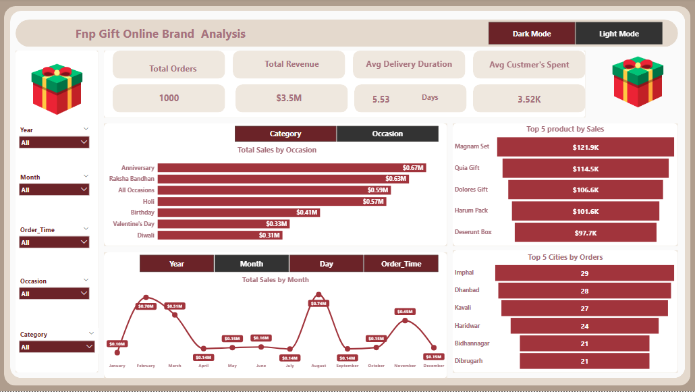
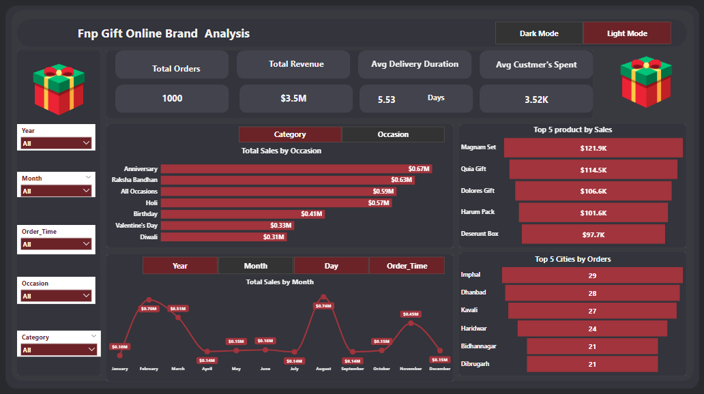

# 📊  Fnp Gift Online Brand Performance Analysis
## Overview
This analysis provides a high-level overview of the Fnp Gift Online Brand's operational and financial performance, focusing on total orders, revenue generation, delivery efficiency, and key performance drivers like occasion, product, and geographic sales patterns.
## 🧹  Data Cleaning 
 load data in Power BI:

Click Transform Data → it opens Power Query Editor.

Common Cleaning Steps:

Rename Columns → make them clear and consistent.

Change Data Types → set columns to correct types (Date, Decimal, Whole Number, Text).

Remove Unnecessary Columns → right-click column → Remove.

Remove Blank or Error Rows:

Home → Remove Rows → Remove Blank Rows / Remove Errors.

Handle Missing Values (Nulls):

Replace with a fixed value → Transform → Replace Values.

Or remove rows with nulls.

Format Text Columns:

Transform → Format → Trim, Clean, UPPER/lower case.
## 🔹  Data Modeling 
 we use Data modeling in this project  to organize   tables into Fact & Dimension structure, creating relationships, and using DAX for calculations. This ensures your dashboards are fast, accurate, and scalable.
 ## 🔑 Key Insights
- Total Revenue: $3.5 Million
- Total Orders: 1,000
- Avg Custmer's Spent: $3.52K
- Avg Delivery Duration: 5.53 Days
## Revenue by Categories 
The highest sales revenue comes from **Colors ($1.01M)**, then **Soft Toys  ($0.74M)** and **Sweets  ($0.73M)** .
## Revenue by  Occasions 
The highest sales revenue comes from **Anniversary ($0.67M)**, then **Raksha Bandhan ($0.63M)** ,**All Occasions ($0.59M)**and **Holi ($0.57M)**
## Revenue by Products
**The Magnum Set ($121.5K)** is the top-selling product, with the **Quia Gift ($114.5K) and Dolores Gift ($106.6K)** .
## 🌍 Geographical Insights
Imphal (29 orders), Dhanbad (28 orders), and Kavali (27 orders) 

## 📈 Monthly Revenue Trends
- revenue peaks in Feb ,Mar, Aug, and Nov aligning with major festivals and gifting occasions.
- Revenue dipped in Jan ,Apr,June, July,Sep and Dec indicating possible off-season periods.

 ## 📸 Dashboard Preview
## Light mode

## Dark mode

 ## 📌 Conclusion
- Focus marketing efforts and inventory stocking for peak months (March, August, October, December) to capitalize on high demand
- Focus on product development and promotions around the top-performing occasions
- focus on Low-Performing Months,prepare plans to increase sales during low months ,  through new product launches or seasonal, non-occasion-specific campaigns.
- Launch  special delivery promotions in the top-ordering cities  to build customer loyalty and increase repeat business in these high-volume markets.
 

 

 
